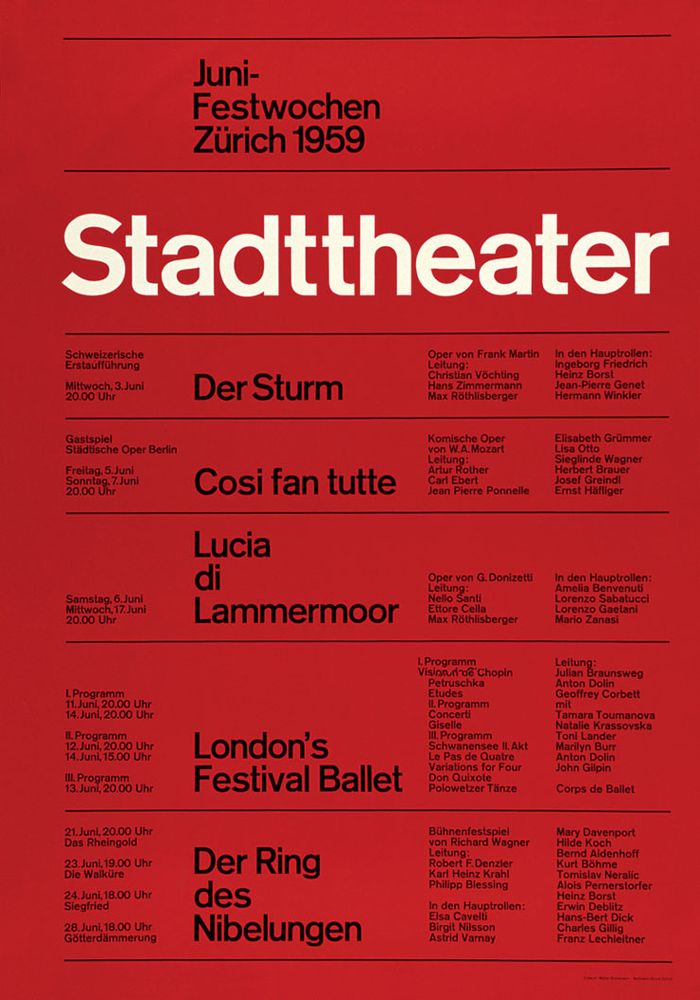

<h1 align="center"> Poster Josef Müller-Brockmann </h1>

Estudo feito com foco na prática de HTML e CSS.

  <a href="#-tecnologias">Tecnologias</a>&nbsp;&nbsp;&nbsp;|&nbsp;&nbsp;&nbsp;
  <a href="#-projeto">Projeto</a>&nbsp;&nbsp;&nbsp;|&nbsp;&nbsp;&nbsp;
  <a href="#-referência">Referência</a>&nbsp;&nbsp;&nbsp;|&nbsp;&nbsp;&nbsp;
  <a href="#-licença">Poster</a>

 

## Tecnologias

Esse projeto foi desenvolvido com as seguintes tecnologias:

- HTML e CSS
- Git e GitHub

## Projeto

Neste projeto, recriei um pôster tipográfico utilizando apenas HTML e CSS, como parte de um exercício acadêmico. O design é inspirado nos trabalhos do designer suíço Josef Müller-Brockmann.

- [Acesse o projeto finalizado](https://r1ck-jj.github.io/poster/)

## Referência

  

---

Feito por Ricardo de Jesus